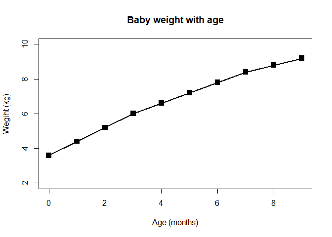
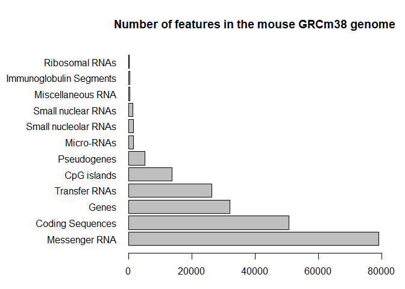
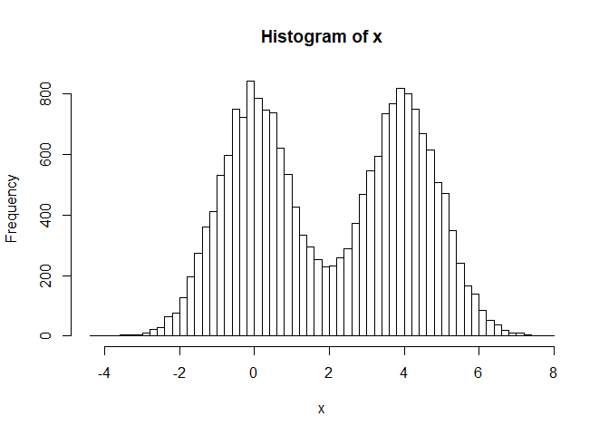
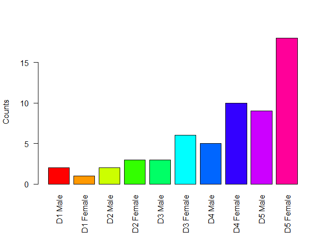
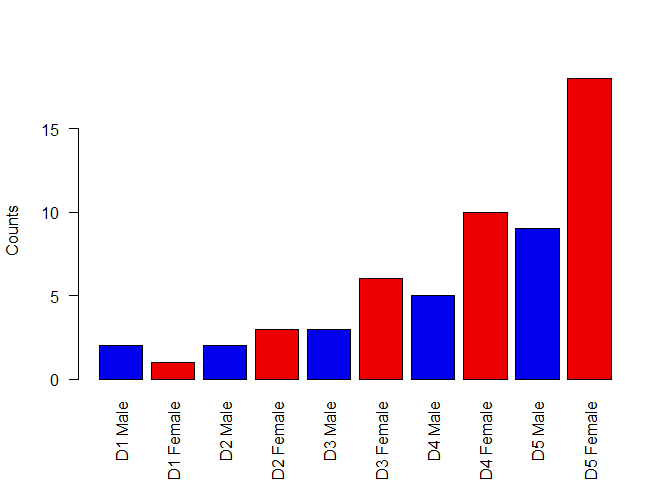
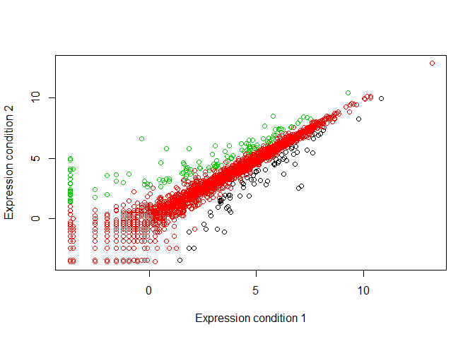
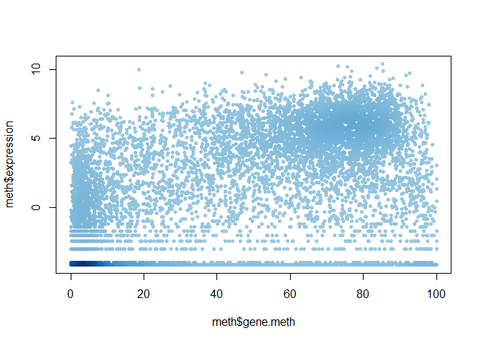
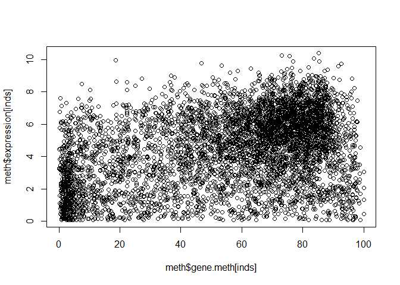
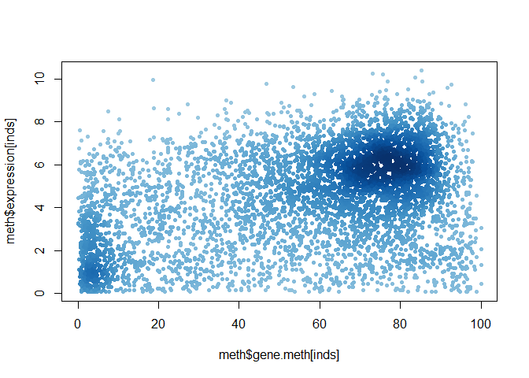
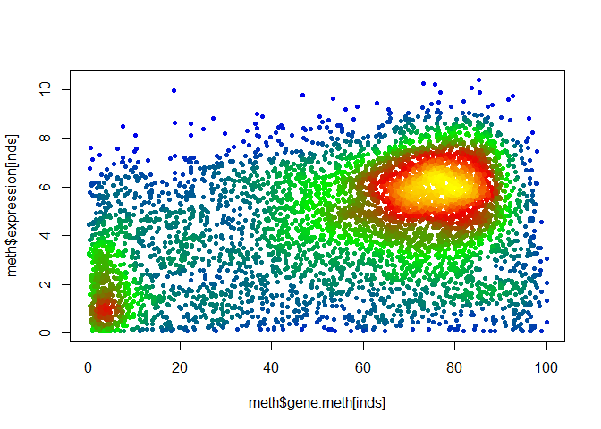

Class 05: Data exploration and visualization in R
================

Line plot
---------

``` r
weight <- read.table ("bimm143_05_rstats/weight_chart.txt", header=TRUE)
```

``` r
plot(weight$Age, weight$Weight,type="o", pch=15, cex=1.5,lwd=2,ylim=c(2,10), xlab="Age (months)", ylab = "Wegiht (kg)", main = "Baby weight with age")
```

 \#\# Barplot

``` r
mouse <- read.table("bimm143_05_rstats/feature_counts.txt", sep="\t",header=TRUE)
```

``` r
barplot(mouse$Count)
```


Edit the barplot.

``` r
par(mar=c(3.1, 11.1, 4.1, 2))
barplot(mouse$Count, names.arg=mouse$Feature, 
        horiz=TRUE, ylab="", 
        main="Number of features in the mouse GRCm38 genome", 
        las=1, xlim=c(0,80000))
```



Histograms
----------

``` r
x <- c(rnorm(10000),rnorm(10000)+4)
hist(x, breaks=80)
```



Using color in plots
--------------------

``` r
mf <- read.delim("bimm143_05_rstats/male_female_counts.txt")

barplot(mf$Count, names.arg=mf$Sample, col=rainbow(nrow(mf)), 
        las=2, ylab="Counts")
```



``` r
barplot(mf$Count, names.arg=mf$Sample, col=c("blue2","red2"), 
        las=2, ylab="Counts")
```



``` r
genes <- read.delim("bimm143_05_rstats/up_down_expression.txt")

table(genes$State)
```

    ## 
    ##       down unchanging         up 
    ##         72       4997        127

``` r
plot(genes$Condition1, genes$Condition2, col=genes$State, 
     xlab="Expression condition 1", ylab="Expression condition 2")
```



Coloring by point density
-------------------------

``` r
meth <- read.delim("bimm143_05_rstats/expression_methylation.txt")
```

``` r
dcols <- densCols(meth$gene.meth, meth$expression)

# Plot changing the plot character ('pch') to a solid circle
plot(meth$gene.meth, meth$expression, col = dcols, pch = 20)
```



``` r
# Find the indices of genes with above 0 expresion
inds <- meth$expression > 0

# Plot just these genes
plot(meth$gene.meth[inds], meth$expression[inds])
```



``` r
## Make a desnisty color vector for these genes and plot
dcols <- densCols(meth$gene.meth[inds], meth$expression[inds])

plot(meth$gene.meth[inds], meth$expression[inds], col = dcols, pch = 20)
```



``` r
dcols.custom <- densCols(meth$gene.meth[inds], meth$expression[inds],
                         colramp = colorRampPalette(c("blue2",
                                                      "green2",
                                                      "red2",
                                                      "yellow")) )

plot(meth$gene.meth[inds], meth$expression[inds], 
     col = dcols.custom, pch = 20)
```


