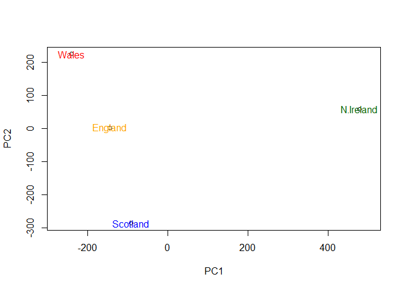
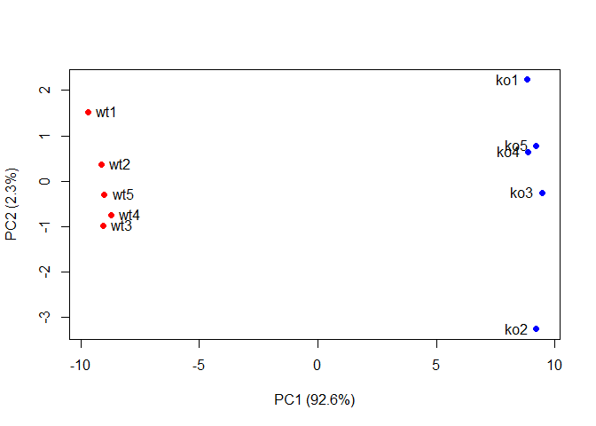

Class08: Principal Component Analysis (PCA)
================

PCA of UK food data
-------------------

``` r
x <- read.csv("UK_foods.csv")
```

Q. How many rows and columns are in "UK\_foods.csv"?

``` r
dim(x)
```

    ## [1] 17  5

``` r
head(x)
```

    ##                X England Wales Scotland N.Ireland
    ## 1         Cheese     105   103      103        66
    ## 2  Carcass_meat      245   227      242       267
    ## 3    Other_meat      685   803      750       586
    ## 4           Fish     147   160      122        93
    ## 5 Fats_and_oils      193   235      184       209
    ## 6         Sugars     156   175      147       139

``` r
rownames(x) <- x[,1]
x <- x[,-1]
head(x)
```

    ##                England Wales Scotland N.Ireland
    ## Cheese             105   103      103        66
    ## Carcass_meat       245   227      242       267
    ## Other_meat         685   803      750       586
    ## Fish               147   160      122        93
    ## Fats_and_oils      193   235      184       209
    ## Sugars             156   175      147       139

``` r
pca <- prcomp(t(x))
summary(pca)
```

    ## Importance of components:
    ##                             PC1      PC2      PC3       PC4
    ## Standard deviation     324.1502 212.7478 73.87622 4.189e-14
    ## Proportion of Variance   0.6744   0.2905  0.03503 0.000e+00
    ## Cumulative Proportion    0.6744   0.9650  1.00000 1.000e+00

Generate a plot of PC1 vs PC2.
==============================

``` r
plot(pca$x[,1],pca$x[,2],xlab="PC1",ylab="PC2",xlim=c(-270,500))
text(pca$x[,1],pca$x[,2], colnames(x), col=c("orange","red","blue","darkgreen"))
```



Examine the "loadings"
======================

This will help to determine how the origional variable (dimensions) contribute to the new PCs

``` r
par(mar=c(10, 3, 0.35, 0))
barplot( pca$rotation[,1], las=2 )
```


``` r
## The inbuilt biplot() can be useful for small datasets 
biplot(pca)
```


PCA of RNA-seq data
-------------------

``` r
rna.data <- read.csv("expression.csv", row.names=1)
head(rna.data)
```

    ##        wt1 wt2  wt3  wt4 wt5 ko1 ko2 ko3 ko4 ko5
    ## gene1  439 458  408  429 420  90  88  86  90  93
    ## gene2  219 200  204  210 187 427 423 434 433 426
    ## gene3 1006 989 1030 1017 973 252 237 238 226 210
    ## gene4  783 792  829  856 760 849 856 835 885 894
    ## gene5  181 249  204  244 225 277 305 272 270 279
    ## gene6  460 502  491  491 493 612 594 577 618 638

Generating plots for RNA data
=============================

``` r
pca <- prcomp(t(rna.data), scale=TRUE)
 
plot(pca$x[,1], pca$x[,2])
```


``` r
#This plot is made to separate the samples into two groups of 5 samples each. 
```

``` r
# Calculate how much variation in the original data
pca.var <- pca$sdev^2

pca.var.per <- round(pca.var/sum(pca.var)*100,1)
pca.var.per
```

    ##  [1] 92.6  2.3  1.1  1.1  0.8  0.7  0.6  0.4  0.4  0.0

Generate scree-plot
===================

``` r
barplot(pca.var.per, main="Scree Plot", xlab="Principal Component", ylab="Percent Variation")
```


``` r
#This scree-plot shows that PC1 is where all the action is.  
```

Making PCA plot look more efficient
===================================

``` r
## A vector of colors for wt and ko samples
colvec <- colnames(rna.data)
colvec[grep("wt", colvec)] <- "red"
colvec[grep("ko", colvec)] <-"blue"

plot(pca$x[,1], pca$x[,2], col=colvec, pch=16, xlab=paste0("PC1 (",pca.var.per[1], "%)"),ylab=paste0("PC2 (",pca.var.per[2], "%)"))

text(pca$x[,1], pca$x[,2], labels = colnames(rna.data), pos=c(rep(4,5), rep(2,5)))
```



Find the top 10 genes that contribute most to PC1 in either positive or negative way.
=====================================================================================

``` r
loading_scores <- pca$rotation[,1]

gene_scores <- abs(loading_scores) 
gene_score_ranked <- sort(gene_scores, decreasing=TRUE)
```

The names of the top 10 genes are listed below.
===============================================

``` r
top_10_genes <- names(gene_score_ranked[1:10])

top_10_genes 
```

    ##  [1] "gene100" "gene66"  "gene45"  "gene68"  "gene98"  "gene60"  "gene21" 
    ##  [8] "gene56"  "gene10"  "gene90"
